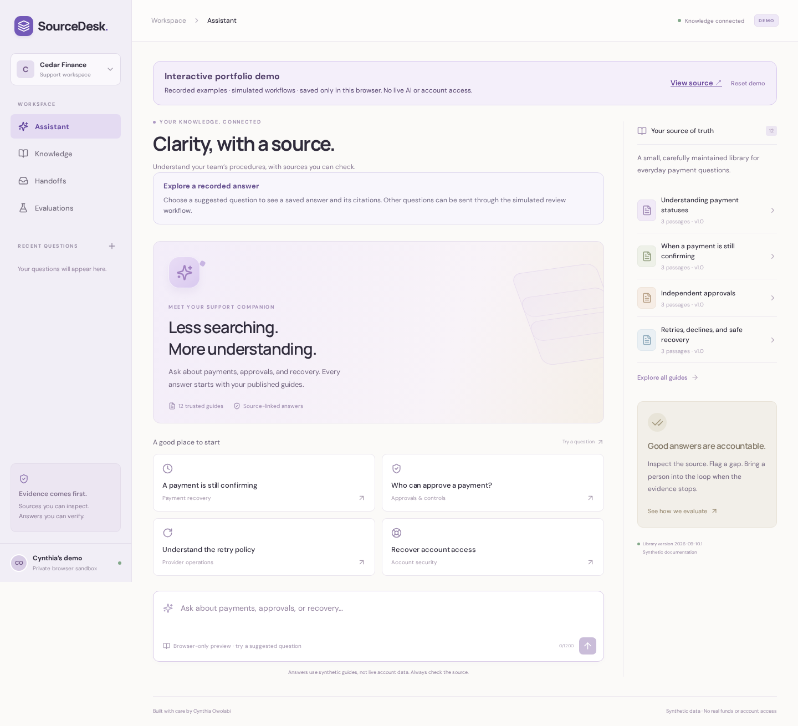
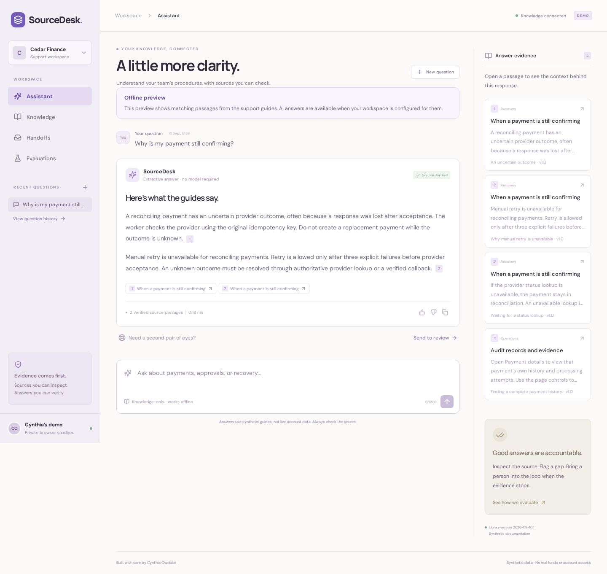

# SourceDesk

**Payment support with evidence, careful handoffs, and measurable quality.**

SourceDesk is a support workspace by Cynthia Owolabi. Ask a question, inspect the passages behind an answer, flag a gap, and carry unresolved questions into a review queue. It is the applied-AI companion to [LedgerDesk](https://github.com/adebolaowolabi32/payment-operations-console), using original synthetic payment documentation.



## Try the portfolio preview

**[Open the interactive demo](https://adebolaowolabi32.github.io/sourcedesk/)** · [Browse the implementation](https://github.com/adebolaowolabi32/sourcedesk)

The GitHub Pages preview runs entirely in your browser: try suggested questions, inspect recorded answers and citations, give feedback, and simulate a review case. Examples use synthetic data. The evaluation screen displays a saved regression report. Preview history is stored only in this browser and can be cleared with **Reset demo**. It does not call OpenAI or connect to a backend/database.

The repository also contains the runnable backend and real GPT/pgvector implementation, with tests and measured live smoke results. These are engineering evidence for this portfolio project; no production service is operated.

## Install and run

Node.js 22.13+ (22.x) or 24+ and npm are the only runtime prerequisites. No API key, Docker, or external database is needed for the default demo.

```bash
git clone https://github.com/adebolaowolabi32/sourcedesk.git
cd sourcedesk
npm ci
npm run dev
```

Open **http://127.0.0.1:5175**. The API runs on localhost:3010, and SQLite stores your sandbox in `data/sourcedesk.db`. For a remote VM, run this from your laptop:

```bash
ssh -L 5175:127.0.0.1:5175 YOUR_USER@YOUR_VM_ADDRESS
```

Then open localhost:5175 on your laptop. The frontend proxies API traffic, so only the frontend port needs forwarding.

See the [installation guide](docs/INSTALLATION.md) for the compiled app, configuration, checks, troubleshooting, and optional model setup.

## Try it

- **Assistant:** ask “Why is my payment still confirming?” Open a citation to inspect the exact source passage. Save feedback or return to the question later.
- **Knowledge:** browse 12 synthetic guides covering payments, recovery, access, controls, operations, and local setup.
- **Handoffs:** ask “What is my bank balance?” The assistant cannot access live accounts. Create a case with context, inspect its evidence, and record a resolution note.
- **Evaluations:** run the 40-case regression suite and inspect every outcome, including unsupported questions and injection attempts.

Each browser gets its own seven-day session. Questions, feedback, and review notes persist on disk and are scoped to that session. This is a local support-team simulation: handoffs do not email anyone, change LedgerDesk payments, or access bank data.

## How answers work

The default engine performs BM25-style lexical retrieval with explicit normalization/synonyms over section-sized passages. A coverage/score gate abstains when evidence is weak. Account-specific requests and recognized instruction overrides take the handoff path. Accepted answers display **exact source passages** with server-verified document/section IDs.

Optional **GPT + pgvector mode** embeds the guides and question with OpenAI, retrieves the six closest passages from PostgreSQL, and uses the Responses API to synthesize a concise explanation. Each claim includes source IDs and exact supporting quotes checked against retrieved text. Invalid quotes, unavailable dependencies, refusals, and unsupported answers become review handoffs. There are no payment-changing tools or secrets in model context.

Exact quote validation establishes citation provenance; it does not prove that a model-written claim is entailed by the quote. Review sources before acting. The local corpus and request gates reduce tested failure cases but are not universal prompt-injection defenses.

## Measured results

The initial authored regression run passed **38/40 cases**. It exposed a missing plural-role synonym and an account-specific missing-funds question that needed handoff. Both fixes are documented; the current saved run passes **40/40**:

| Metric                                                           | Saved local result         |
| ---------------------------------------------------------------- | -------------------------- |
| Expected-source recall on answerable cases                       | 26/26                      |
| Correct handoffs on unsupported/account-specific/injection cases | 14/14                      |
| Citation identity and exact-text validity                        | 100% of rendered citations |
| API cost, default extractive run                                 | $0                         |

See the [full report](docs/evaluation-report.json), [original baseline](docs/baseline-evaluation.json), and [evaluation methodology](docs/EVALUATION.md). Latency is measured on each run and is not a production benchmark. These 40 visible synthetic cases are a regression suite, **not a claim of general accuracy**. The fixed “holdout” subset was inspected during development and is not an independent blind evaluation. A separate five-case live smoke check is recorded below; it is not an independent quality benchmark.



## GPT and vector search

See [installation](docs/INSTALLATION.md#gpt-and-vector-search) for secure key configuration and PostgreSQL setup. A key alone does not enable requests.

```bash
docker compose up -d --wait
# Configure the ignored .env as described in the installation guide.
npm run index:knowledge
npm run dev
```

`ANSWER_MODE=rag` enables semantic retrieval and generated answers; `openai` is an alias. Defaults are `gpt-5.4-mini` and `text-embedding-3-small` with 1,536 dimensions. Indexing sends the synthetic guides to OpenAI; answering sends the question for embedding, then the question and up to six passages for generation. Responses use `store:false`, following [OpenAI structured-output documentation](https://developers.openai.com/api/docs/guides/structured-outputs). PostgreSQL stores embeddings; SQLite retains browser sessions, answers, and review cases.

Index generations include the corpus content hash and embedding configuration. Re-indexing an unchanged corpus makes no embedding calls. Failed indexing publishes no partial generation. Rebuild after changing guides or embedding model, then restart the app. Startup and `/api/ready` check index completeness.

Controlled provider tests and real PostgreSQL tests pass. After funding the API account, live indexing stored **30 passages** and the five-case live smoke check passed **5/5**. A review of the first run found wording that implied knowledge of a specific payment; the prompt was tightened and all five cases passed again. Both [initial](docs/live-evaluation-initial.json) and [final](docs/live-evaluation-report.json) results are retained. Combined indexing and both runs used approximately **$0.00839** at verified standard token rates (caching discounts ignored), below the user's $1 test limit. This is usage-based estimation, not an invoice or a general accuracy claim.

`npm run evaluate:live` indexes if needed and uses a persistent, conservative $0.50 request budget in `data/live-test-budget.json`, covering retries within this serial test runner. It permits only the two priced models, limits output, and reserves a doubled byte-based input bound before sending each request. Failed requests keep their reservation. Run only one live test runner at a time; do not delete its ledger to bypass a budget. This test budget does not limit interactive app usage or the standalone indexing command.

The dashboard and `npm run evaluate` always evaluate the offline baseline without API calls. Provider token usage is recorded; interactive RAG dollar cost remains `null`. The live report separately records usage-based estimated cost and conservative budget reservations.

## Validate

```bash
npm test
npm run build
npx playwright install --with-deps chromium
npm run test:e2e
npm run evaluate
npm run format:check
```

Backend tests cover exact citations, abstention, quarantined instruction-bearing passages, model response validation, session isolation, persistence, history pagination, handoff idempotency, optimistic case resolution, and HTTP protections. Browser checks cover answers/citations/feedback, review cases, guide search, evaluation controls, desktop/mobile layouts, and error recovery. CI repeats the checks and saves screenshots and traces.

## Project map

| Path                     | Responsibility                                                 |
| ------------------------ | -------------------------------------------------------------- |
| `knowledge/catalog.json` | Original synthetic corpus, section IDs, and versions           |
| `knowledge/*.md`         | Human-readable copies checked against the catalog              |
| `server/retrieval.ts`    | Normalization, BM25 scoring, passage quarantine                |
| `server/engine.ts`       | Support scope, evidence gate, answer selection                 |
| `server/generator.ts`    | Structured GPT claims and quote validation                     |
| `server/vectors.ts`      | OpenAI embeddings and versioned pgvector retrieval             |
| `server/model.ts`        | Legacy evidence-selector adapter retained for compatibility    |
| `server/store.ts`        | Browser sessions, durable answers/cases, rate limits           |
| `evals/dataset.json`     | Versioned authored regression questions                        |
| `server/evaluation.ts`   | Reproducible graders and measured latency                      |
| `src/`                   | Responsive assistant, source library, reviews, and evaluations |

- [Architecture and boundaries](docs/ARCHITECTURE.md)
- [API reference](docs/API.md)
- [Evaluation methodology](docs/EVALUATION.md)
- [Installation](docs/INSTALLATION.md)

For a hosted team product, the next steps are real identity and organization membership, reviewer assignment, a larger independently held-out corpus, operational monitoring, and independently measured model quality. This repository intentionally contains only synthetic support data.

## Publish the static preview

```bash
npm ci
npm run build:portfolio
npm run preview:portfolio
```

Open http://127.0.0.1:4173/sourcedesk/. `npm run test:portfolio` exercises the static artifact, including citations, saved feedback, simulated cases, saved evaluation, mobile layout, and no backend API requests. The Pages workflow builds and tests this same artifact before deployment. Only `dist/` is uploaded; server files, databases, and local credentials are excluded.

The preview uses checked-in synthetic fixtures in `src/demo-fixtures.json`. To refresh them after intentionally updating the corpus or saved reports, run `node --import=tsx scripts/demo-fixtures.ts` and format/review the resulting file. This generator uses the offline engine and the existing live report; it makes no API calls.
