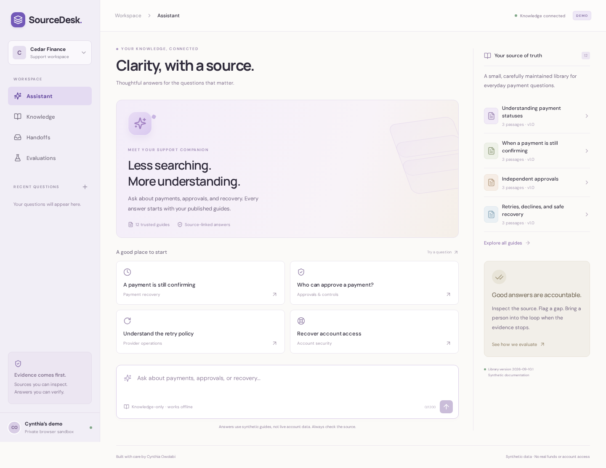

# SourceDesk

**Payment support with evidence, careful handoffs, and measurable quality.**

SourceDesk is a support workspace by Cynthia Owolabi. Ask a question, inspect the passages behind an answer, flag a gap, and carry unresolved questions into a review queue. It is the applied-AI companion to [LedgerDesk](https://github.com/adebolaowolabi32/payment-operations-console), using original synthetic payment documentation.



## Install and run

Node.js 22.13+ (22.x) or 24+ and npm are the only runtime prerequisites. No API key, Docker, or external database is needed for the default demo.

```bash
git clone https://github.com/adebolaowolabi32/sourcedesk.git
cd sourcedesk
npm ci
npm run dev
```

Open **http://127.0.0.1:5175**. The API runs on localhost:3010, and SQLite stores your sandbox in `data/sourcedesk.db`. For a remote VM, run this from your laptop:

```bash
ssh -L 5175:127.0.0.1:5175 YOUR_USER@YOUR_VM_ADDRESS
```

Then open localhost:5175 on your laptop. The frontend proxies API traffic, so only the frontend port needs forwarding.

See the [installation guide](docs/INSTALLATION.md) for the compiled app, configuration, checks, troubleshooting, and optional model setup.

## Try it

- **Assistant:** ask “Why is my payment still confirming?” Open a citation to inspect the exact source passage. Save feedback or return to the question later.
- **Knowledge:** browse 12 synthetic guides covering payments, recovery, access, controls, operations, and local setup.
- **Handoffs:** ask “What is my bank balance?” The assistant cannot access live accounts. Create a case with context, inspect its evidence, and record a resolution note.
- **Evaluations:** run the 40-case regression suite and inspect every outcome, including unsupported questions and injection attempts.

Each browser gets its own seven-day session. Questions, feedback, and review notes persist on disk and are scoped to that session. This is a local support-team simulation: handoffs do not email anyone, change LedgerDesk payments, or access bank data.

## How answers work

The default engine performs BM25-style lexical retrieval with explicit normalization/synonyms over section-sized passages. A coverage/score gate abstains when evidence is weak. Account-specific requests and recognized instruction overrides take the handoff path. Accepted answers display **exact source passages** with server-verified document/section IDs.

An optional OpenAI Responses adapter can select passages from retrieved evidence. It uses strict structured output, validates every selected ID, and never renders model-written prose. Refusals, timeouts, malformed results, and unknown citation IDs produce a handoff instead of an unverifiable answer. There are no payment-changing tools or credentials in the model context.

This deliberately favors inspectability and bounded behavior over conversational fluency. It is not an embedding/vector search engine, and the default demo does not run a language model. Lexical retrieval can miss paraphrases or return text that contains query terms without answering the intended question; citation validity alone does not prove relevance. The optional model is an evidence selector, not an unrestricted chatbot.

## Measured results

The initial authored regression run passed **38/40 cases**. It exposed a missing plural-role synonym and an account-specific missing-funds question that needed handoff. Both fixes are documented; the current saved run passes **40/40**:

| Metric                                                           | Saved local result         |
| ---------------------------------------------------------------- | -------------------------- |
| Expected-source recall on answerable cases                       | 26/26                      |
| Correct handoffs on unsupported/account-specific/injection cases | 14/14                      |
| Citation identity and exact-text validity                        | 100% of rendered citations |
| API cost, default extractive run                                 | $0                         |

See the [full report](docs/evaluation-report.json), [original baseline](docs/baseline-evaluation.json), and [evaluation methodology](docs/EVALUATION.md). Latency is measured on each run and is not a production benchmark. These 40 visible synthetic cases are a regression suite, **not a claim of general accuracy**. The fixed “holdout” subset was inspected during development and is not an independent blind evaluation. No live OpenAI quality or pricing benchmark has been run.


## Optional model connection

Opt in explicitly using environment variables. A key alone does not enable external requests.

```bash
export ANSWER_MODE=openai
export OPENAI_API_KEY='YOUR_KEY'
export OPENAI_MODEL='YOUR_STRUCTURED_OUTPUT_CAPABLE_MODEL'
npm run dev
```

The backend sends the question and up to four synthetic passages to the configured model. Keys remain server-side. `store:false` is included in the request. Select a model available to your account that supports Responses structured outputs. The request format follows [OpenAI’s official structured-output documentation](https://developers.openai.com/api/docs/guides/structured-outputs).

The adapter is tested with controlled responses for schema handling, refusals, timeout/failure fallback, and citation verification. **It has not been exercised against a live paid model.** The dashboard and `npm run evaluate` always evaluate the local extractive baseline, even when interactive model mode is enabled. They do not spend API credits.

Set `INPUT_USD_PER_MILLION` and `OUTPUT_USD_PER_MILLION` to prices you have verified for your chosen model if you want an estimated per-answer token cost recorded. Without prices, model cost is `null`, not zero. Token counts come from provider usage fields; estimates exclude caching/tier adjustments and are not invoices.

## Validate

```bash
npm test
npm run build
npx playwright install --with-deps chromium
npm run test:e2e
npm run evaluate
npm run format:check
```

Backend tests cover exact citations, abstention, quarantined instruction-bearing passages, model response validation, session isolation, persistence, history pagination, handoff idempotency, optimistic case resolution, and HTTP protections. Browser checks cover answers/citations/feedback, review cases, guide search, evaluation controls, desktop/mobile layouts, and error recovery. CI repeats the checks and saves screenshots and traces.

## Project map

| Path                     | Responsibility                                                 |
| ------------------------ | -------------------------------------------------------------- |
| `knowledge/catalog.json` | Original synthetic corpus, section IDs, and versions           |
| `knowledge/*.md`         | Human-readable copies checked against the catalog              |
| `server/retrieval.ts`    | Normalization, BM25 scoring, passage quarantine                |
| `server/engine.ts`       | Support scope, evidence gate, answer selection                 |
| `server/model.ts`        | Optional structured Responses adapter                          |
| `server/store.ts`        | Browser sessions, durable answers/cases, rate limits           |
| `evals/dataset.json`     | Versioned authored regression questions                        |
| `server/evaluation.ts`   | Reproducible graders and measured latency                      |
| `src/`                   | Responsive assistant, source library, reviews, and evaluations |

- [Architecture and boundaries](docs/ARCHITECTURE.md)
- [API reference](docs/API.md)
- [Evaluation methodology](docs/EVALUATION.md)
- [Installation](docs/INSTALLATION.md)

For a hosted team product, the next steps are real identity and organization membership, reviewer assignment, a larger independently held-out corpus, operational monitoring, and measured model-assisted retrieval. This repository intentionally contains only synthetic support data.
