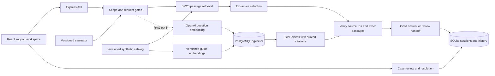

# Architecture

## Evidence pipeline

The corpus uses stable document/section IDs. Each section is a retrieval unit. Normalization removes stop words and expands a small explicit synonym mapping; BM25 scores account for term frequency, passage length, and corpus document frequency. Retrieved passages expose matches and raw relevance scores in the API; those scores are not calibrated confidence probabilities.

A scope gate handles tested account-specific requests and instruction overrides. A coverage/score gate routes weak retrieval to review. In extractive mode the engine selects up to two relevant passages. In RAG mode, OpenAI embeds the question, pgvector performs exact cosine search over the current generation, and GPT receives up to six source passages. The model produces up to five claims, each with one to three source IDs and exact contiguous quotes. Every quote must occur in the associated retrieved passage before any claim is rendered. This verifies provenance, not semantic entailment. There are no model tools, payment mutations, arbitrary URLs, or secrets in retrieved content.

Documents with recognized instruction-override patterns are quarantined from retrieval. This is a defense for tested cases, not a universal injection detector. The app’s local corpus is curated: it does not ingest arbitrary webpages or user uploads. The API validates input lengths, the model adapter bounds time/output, and at most four answer requests run concurrently in one process.

## Session and case persistence

A random HttpOnly SameSite=Strict cookie identifies a browser session. Only its hash is stored. Every answer/case read or write scopes by that session; another browser cannot retrieve records by guessing IDs. This is browser-level demo isolation, not user authentication or organization authorization. Sessions expire after seven days. Production cookies require HTTPS.

SQLite persists answers, citation snapshots, feedback, cases, and evaluation runs. A handoff transaction links one case per answer, making repeat creation idempotent. Version checks prevent stale or duplicate resolution. Resolving a case only records a reviewer note. SQL transactions never span model network calls. History uses a timestamp/UUID cursor and bounded pages.

The app targets a single local process and small synthetic corpus. SQLite synchronous work, local concurrency limits, and browser-only identity are explicit limits. A shared hosted support product should use real identity, organization/reviewer permissions, deployment-wide concurrency controls, and operational monitoring.

## Evaluation boundaries

The CLI and UI evaluate the local extractive baseline, never the paid model. Source text validity and expected-source recall are separate metrics. Reports retain per-case failures and elapsed times; the original imperfect baseline is committed alongside the later regression result. See the evaluation guide before interpreting the numbers.

## Vector persistence

The vector generation hashes corpus content, embedding model, and dimensions. The curated sections are embedded in batches of 32. A transaction and advisory lock replace one generation atomically after all embedding batches succeed. Complete unchanged indexes are reused. Exact cosine search is appropriate for this small corpus; no approximate index is configured. Missing/stale indexes block startup, and readiness rechecks completeness. Provider or database failures become handoffs, without silent lexical fallback in RAG mode. Embeddings live in PostgreSQL; saved citation text stays in SQLite so historical evidence survives corpus changes.

## GitHub Pages portfolio preview

The `portfolio` Vite build routes UI operations to `src/demo.ts`, which uses only recorded synthetic answer/document/evaluation fixtures and browser-local state. Unknown questions explicitly have no recorded answer and can enter a simulated review. Saved GPT examples are labeled recorded; the evaluation control reloads a saved report. Reset removes demo state. Browser tests exercise the `/sourcedesk/` base path and verify that no backend or OpenAI requests occur. GitHub Actions uploads only the static `dist/` artifact. The full implementation described above remains available for local engineering review, with no production backend operated.
