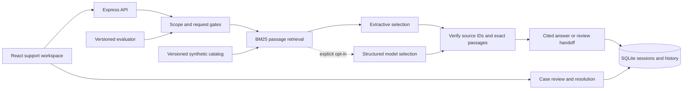

# Architecture

## Evidence pipeline

The corpus uses stable document/section IDs. Each section is a retrieval unit. Normalization removes stop words and expands a small explicit synonym mapping; BM25 scores account for term frequency, passage length, and corpus document frequency. Retrieved passages expose matches and raw relevance scores in the API; those scores are not calibrated confidence probabilities.

A scope gate handles tested account-specific requests and instruction overrides. A coverage/score gate routes weak retrieval to review. In extractive mode the engine selects up to two relevant passages. In optional model mode, the server supplies up to four passages and accepts up to three verified IDs through a strict schema. Only original passage text is rendered. There are no model tools, payment mutations, arbitrary URLs, or secrets in retrieved content.

Documents with recognized instruction-override patterns are quarantined from retrieval. This is a defense for tested cases, not a universal injection detector. The app’s local corpus is curated: it does not ingest arbitrary webpages or user uploads. The API validates input lengths, the model adapter bounds time/output, and at most four answer requests run concurrently in one process.

## Session and case persistence

A random HttpOnly SameSite=Strict cookie identifies a browser session. Only its hash is stored. Every answer/case read or write scopes by that session; another browser cannot retrieve records by guessing IDs. This is browser-level demo isolation, not user authentication or organization authorization. Sessions expire after seven days. Production cookies require HTTPS.

SQLite persists answers, citation snapshots, feedback, cases, and evaluation runs. A handoff transaction links one case per answer, making repeat creation idempotent. Version checks prevent stale or duplicate resolution. Resolving a case only records a reviewer note. SQL transactions never span model network calls. History uses a timestamp/UUID cursor and bounded pages.

The app targets a single local process and small synthetic corpus. SQLite synchronous work, local concurrency limits, and browser-only identity are explicit limits. A shared hosted support product should use real identity, organization/reviewer permissions, deployment-wide concurrency controls, and operational monitoring.

## Evaluation boundaries

The CLI and UI evaluate the local extractive baseline, never the paid model. Source text validity and expected-source recall are separate metrics. Reports retain per-case failures and elapsed times; the original imperfect baseline is committed alongside the later regression result. See the evaluation guide before interpreting the numbers.
